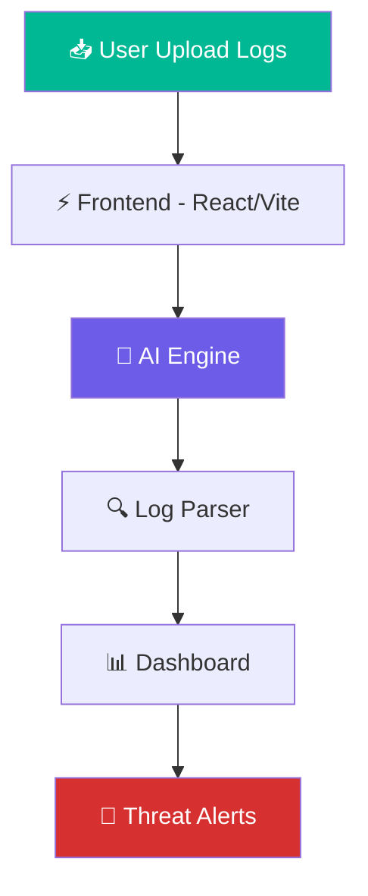
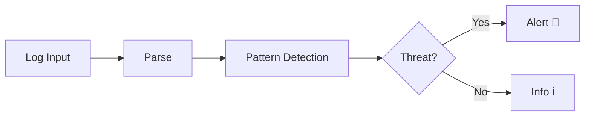

div align="center">
<br>
# ⚡ NetLens AI — Intelligent Cybersecurity Log Analyzer
 
### *Turning Raw Network Logs into Actionable Intelligence*
 
<br>


<br>


 
---
 
### 🚀 A next-gen AI dashboard that **analyzes**, **detects**, and **explains** network threats in real-time
 
<br>
| 📥 Input | 🤖 Processing | 📊 Output |
|:---:|:---:|:---:|
| Syslog · VPC Logs | AI Detection · Pattern Matching | Insights · Alerts · Dashboard |
 
</div>
---
 
## 🧠 Why NetLens AI?
 
Traditional network log analysis is:
 
- ❌ Hard to read
- ❌ Time consuming
- ❌ Error-prone and inconsistent
**NetLens AI solves this with an end-to-end pipeline:**
 
```
📥 Raw Logs  →  🤖 AI Analysis  →  📊 Visual Dashboard  →  🚨 Threat Detection
```
 
---
 
## ✨ Key Features
 
### 🔍 Intelligent Log Processing
- Parses **Syslog** and **VPC Flow logs** out of the box
- Converts raw, unstructured logs into human-readable insights
### 🚨 Threat Detection
- SSH brute force attack detection
- Suspicious IP address tracking
- Anomaly and outlier detection
### 📊 Interactive Dashboard
- Real-time log event timeline
- Severity level distribution charts
- Consolidated incident overview panel
### ⚡ Performance
- Instant client-side log parsing
- Lightweight frontend powered by Vite
---
 
## 🏗️ System Architecture
 
### Processing Pipeline
 

 
### Detection Flow
 

 
---
 
## 🛠️ Tech Stack
 
| Layer | Technology |
|:---:|:---|
| 🎨 Frontend | React 18 + Vite + TypeScript |
| 🎭 UI Styling | Tailwind CSS |
| 🤖 AI Engine | Rule-based + ML-ready |
| ⚡ Runtime | Node.js |
| ☁️ Deployment | Vercel |
 
---
 
## 📂 Project Structure
 
```
ai-network-log-translator/
│
├── src/
│   ├── components/      # Reusable UI components
│   ├── utils/           # Helper functions & parsers
│   ├── data/            # Sample log files
│   ├── App.tsx          # Root application component
│   └── main.tsx         # Application entry point
│
├── screenshots/         # Dashboard & demo images
├── index.html
├── package.json
├── vite.config.ts
└── README.md
```
 
---
 
## 📸 Screenshots
 
<div align="center">
| Dashboard View | Log Analysis |
|:---:|:---:|
 ||
 

||

||
|


 
</div>
---
 
## 🎥 Live Demo
 
<div align="center">

</div>
---
 
## ⚙️ Installation & Setup
 
### Prerequisites
- Node.js `v18+`
- npm or yarn
### Steps
 
```bash
# 1. Clone the repository
git clone https://github.com/Priya-2531/H2H-Hack-Hustlers-NetMindAI.git
 
# 2. Navigate to the project directory
cd ai-network-log-translator
 
# 3. Install dependencies
npm install
 
# 4. Start the development server
npm run dev
```
 
The app will be available at `http://localhost:5173`.
 
---
 
## 🚀 Deployment
 
Deploy instantly to Vercel:
 
```bash
npx vercel
```
 
---
 
## 🔮 Future Enhancements
 
- 🤖 ML-based attack prediction models
- ☁️ Native AWS CloudWatch & GCP Log integration
- 🔐 OWASP Top 10 threat detection rules
- 📡 Real-time streaming log ingestion
- 🧠 Deep learning anomaly detection
---
 
## 👩‍💻 Author
 
**Priya S**
 
[](https://github.com/Priya-2531)
 
---
 
## ⭐ Support
 
If this project helped you or you find it interesting, please consider giving it a ⭐ — it means a lot!
 
---
 
<div align="center">
*Built with ❤️ for H2H Hack Hustlers Hackathon*
 
</div>
